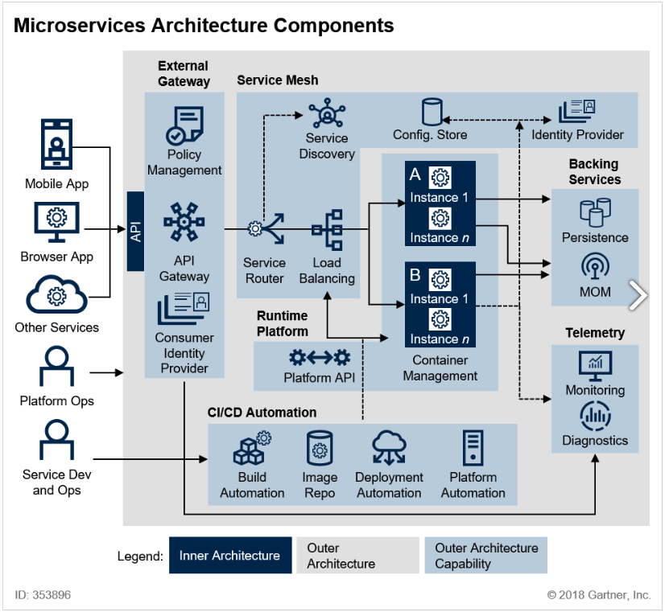
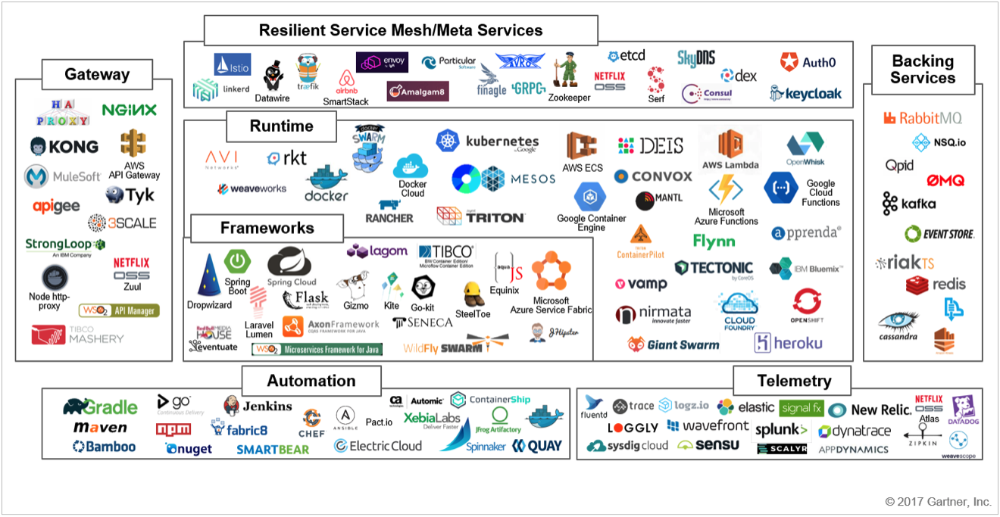
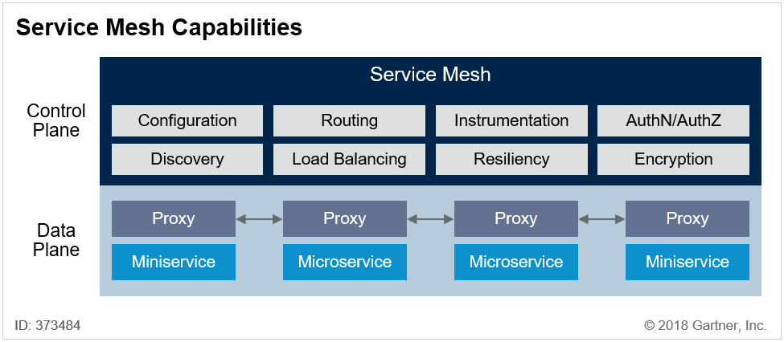
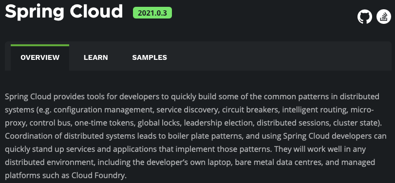

 

# MSA 

## What is the Microservice?
In short, the microservice architectural style is   
an approach to developing a **_single application_**  
as a suite of **_small services_** ,  
each running in its own process and   
communicating with lightweight mechanisms,  
**_on an HTTP resource API_** ... (contd)  

These services are built around **_business capabilities_**  
and **_independently deployable_**  
by fully **_automated deployment_** machinery ... (contd)  

There is a bare minimum of **_centralized management_** of these services,  
which may be written in **_different programming languages_**  
and use **_different data storage_** technologies  
(각각의 서비스별로 특생에 맞게 최적화된 언어와 데이터베이스를 사용하도록 권장하고 있다.)  
> James Lewis and Martin Fowler 

 

## Antifragile

### Auto scaling 
시스템을 구성하는 인스턴스들을 하나의 Auto scaling 그룹으로 묶은 다음  
그룹에서 유지되어야 하는 최소의 인스턴스를 지정할 수 있고  
사용량에 따라 자동으로 인스턴스를 증가할 수 있는 환경을 말한다.  
예를 들어 온라인 쇼핑몰과 같이 5월이나 12월 같이 이벤트가 있는 달에는 서버의 개수를 늘리고  
비수기에는 서버의 운영 개수를 다시 줄이는 작업에 비유할 수 있다.  
이러한 작업을 운영자나 관리자에 의해서 수작업으로 처리되는 것이 아니라  
CPU, 메모리, 네트워크, 데이터베이스의 사용량이나 조건에 따라서 자동으로 처리된다.  

### Microservices
넷플릭스나 아마존은 클라우드 서비스를 가장 잘 구축하고 활용하고 있는 업체로 알려져 있다.  
스프링 클라우드의 초창기 라이브러리 중 많은 부분이 넷플릭스에서 개발되었고 스프링 재단으로 기부되었다.  

### Chaos engineering
시스템이 예측하지 못한 상황이라도 견딜 수 있고 신뢰성을 쌓기 위한 운영 중인 시스템의 실행 방법 또는 규칙.  
- 변동
- 예견된 불확실성
- 예견되지 않는 불확실성 
- 카오스 불확실성 

### Continuous deployments 
- CICD: 지속적인 통합, 지속적인 배포. 

하나의 애플리케이션을 구성하는 수십개, 수백개의 서비스들을  
각각 빌드하고, 테스트하고, 서버에 배포하는 등의 작업을 수작업으로 하게 되면  
하나의 커다란 업무이자 작업 로드가 심하게 걸리는 부분이 되어버린다.  
파이프라인으로 연결시켜 놓으면 작은 변화 뿐만 아니라 전체적인 시스템 업그레이드를 빠르게 할 수 있다.  

- 지속적인 통합, CI(Continuous Integration)
    - 통합 서버, 소스 관리(SCM), 빌드 도구, 테스트 도구
    - ex) Jenkins, Team CI, Travis CI
- 지속적 배포
    - Continuous Delivery: 실행환경에 수작업으로 배포가 필요한 경우. 
    - Continuous Deployment: 운영자나 관리자의 개입없이 실행 환경까지 완벽하게 자동회되어 있는 배포. 
    - Pipe line
- 카나리 배포와 블루그린 배포
    - 카나리 배포: 조금씩 사용자의 범위를 늘려가며 피드백을 통해 배포하는 방식. (사용자 분류 테스트 및 모니터링 가능.)
    - 블루그린 배포: 새로운 버전을 배포함과 동시에 트래픽을 전환하는 방식. (빠른 롤백 가능. 자원이 두 배로 필요.)

 

## Cloud Native Architecture

### 확장 가능한 아키텍처
- 시스템의 수평적 확장에 유연
- 확장된 서버로 시스템의 부하 분산, 가용성 보장
- 시스템 또는 서비스 애플리케이션 단위의 패키지 (컨테이너 기반 패키지)
- 모니터링 

### 탄력적 아키텍처
- 서비스 생성-통합-배포, 비즈니스 환경 변화와 대응 시간 단축 
- 분활된 서비스 구조
- 무상태 통신 프로토콜 
- 서비스의 추가와 삭제 자동을 감지 
- 변경된 서비스 요청에 따라 사용자 요청 처리 (동적 처리)

### 장애 경리 (Fault isolation)
- 특정 서비스에 오류가 발생해도 다른 서비스에 주는 영향을 최소화 

 

## Microservice를 도입할 때 고려해봐야 할 사항들 
- Multiple Rates of Change (변화 비율)  
어느 정도 변화가 생길 것인가? (비용과 시간을 더 투자 대비)   
- Independent Life Cycles (독립적인 라이프사이클)   
애플리케이션을 구성하고 있는 각각의 서비스들이 독립적으로 개발되고 운영될 수 있도록  
서비스 경계가 잘 만들어져있는가?   
- Independent Scalability (독립적인 확장성)  
각각의 서비스를 운영함에 있어서 서비스 유지보수 및 확장성이 가능한가?  
확장을 쉽게 할 수 있는 상태인가?  
- Isolated Failure (격리된 오류)  
오류가 격리되어 있는가? 다른 마이크로서비스들이 받는 영향을 최소화할 수 있는가?  
- Simplify Interactions with External Dependencies (외부 종속의 단순화)  
외부 종속성과의 상호작용을 단순화할 수 있는가? 외부 종속을 줄이고 응집력을 높일 수 있는가?  
- Polyglot Technology (여러 언어 사용)  
Polyglot(여러 언어 및 기술들)을 지원하는가?  
각각 서비스들이 제공해야 하는 서비스에 맞는 언어와 운영 환경을 사용할 수 있는가?   

 

## 12 Factors 
https://12factor.net  
Heroku 개발진들이 시행착오를 바탕으로 제시한 12가지 가이드라인 항목으로   
클라우드 네이티브 애플리케이션을 개발하거나 서비스를 운영할 때 고려해야 할 항목을 정리하였다.   

#### 1. Codebase (빌드되는 소스 코드)
자체 레파지토리에 저장된 각 마이크로서비스의 단일 코드베이스를 뜻한다.  
버전을 제어하고 형상관리를 위해서 코드를 한 곳에서 배포하는 것이 목적이다.  
개발-스테이징-프로덕션에 배포를 위한 코드의 통일적인 관리가 중요하기 때문.  

#### 2. Dependencies (종속성)
각 마이크로서비스는 자체 종속성을 가지고 패키지되어 있으며  
전체 시스템에 영향을 주지 않는 상태에서 변경되고 수정될 수 있어야 한다.  

#### 3. Config (구성 정보)
시스템 코드 외부에서 구성 관리도구를 통해 마이크로서비스에 필요한 작업들을 제어할 수 있는 것.  
동일한 배포가 올바른 구성 환경에서 전파될 수 있도록 하는 것이 목적.   

#### 4. Backing services (서비스 지원)
보조 서비스(데이터베이스, 캐시, 메시지 브로커 등)등을 이용하여  
마이크로서비스에 필요한 기능들을 (서로 종속적이지 않게) 추가로 지원할 수 있어야 한다.  

#### 5. Build, release, run (빌드, 릴리즈, 실행 환경)
빌드, 릴리즈, 실행 환경을 각각 분리해야 한다. 

#### 6. Processes (독립된 자체 프로세스)
각각의 마이크로서비스는 실행 중인 다른 서비스와 분리된 채 자체 프로세스에서 운영될 수 있어야 한다. (독립성)  
필요한 자원이 있을 경우에는 캐시, 데이터 저장소를 이용해서 외부와 데이터를 동기화.   

#### 7. Port binding (포트 바인딩)
포트 바인딩을 통해서 서비스를 노출. (다른 마이크로서비스와 격리가 가능해지기 때문.)  
때문에 각각의 마이크로서비스는 자체 포트에서 노출되는 인터페이스와 같이 자체에 포함된 기능이 있어야 한다. 

#### 8. Concurrency (동시성)
마이크로서비스는 동일한 프로세스를 복사해서 (프로세스 모델을 통해)  
수많은 서비스로 확장해 나가므로 동시성을 가지고 있어야 한다.  
하나의 서비스가 여러 인스턴스에 동일한 형태로 복사가 운영되므로 부하분산이 가능하다. 

#### 9. Disposability (서비스 삭제 가능성)
빠른 확장과 정상 종료(graceful shutdown)가 가능한 상태이어야 한다.  

#### 10. Dev/prod parity (개발/프로덕션 동일화)
개발, 스테이징, 프로덕션을 가능한 한 유사하도록 유지한다. 

#### 11. Logs (로그)
마이크로서비스에서 생기는 로그들을 이벤트 스트림으로 처리한다. 

#### 12. Admin processes (관리 도구)
마이크로서비스 운영을 위한 관리 도구가 있어야 한다.

#### 13. 기타
Pivotal에서 3가지 항목을 더함.
- API first  
    : 각각의 마이크로서비스들을 사용자를 고려한 API 형태로 제공. 
- Telemetry  
    : 모든 지표들은 시각화로 제공.  
- Authentication and authorization   
    : API 사용함에 있어서 인증 부분은 필수. 
    
 

## MSA 표준 구성요소 
 
- CNCF (Cloud Native Computing Foundation)
    - Cloud Native Interactive Landscape
    - https://landscape.cncf.io 

 

### Service Mesh
마이크로서비스 아키텍처를 적용한 시스템의 내부 통신을 말하는 추상적인 개념.   
Service Mesh를 통해서 서비스간 통신을 추상화하며, 
안전하고 빠르고 신뢰성있게 만들어주는 인프라 구조의 네트워크 레이어(계층).  

   
- MSA 인프라 -> 미들웨어
    - 프록시 역할, 인증, 권한 부여, 암호화, 서비스 검색, 요청 라우팅, 로그 밸런싱
    - 자가 치유 복구 서비스
- 서비스간의 통신과 관련된 기능을 자동화

### RESTful Web Service
- Consumer first
- Make best use of HTTP
- Use Request methods
- Use Response Status
- No secure info in URI 
- Use plurals (단수보다는 복수 형태)
    - prefer /users to /user
    - prefer /users/1 to /user/1
- Use nouns for resources (동사 형태보다는 명사 형태)
- For exceptions 
    - define a consistent approach (일괄적인 엔드포인트)
        - /search
        - PUT /gists/{id}/star
        - DELETE /gists/{id}/star
 

## Spring Cloud
> "By 2017, at least 70% of new enterprise java applications  
> won't be deployed on traditional app servers" - Gartner  

   
스프링 클라우드를 사용하기 위해서는 스프링 부트가 필수이다.  
https://spring.io/projects/spring-cloud   

### 본 프로젝트에서 Spring Cloud를 구성하기 위해서 필요한 것 
- Centralized configuration management  
    - 환경 설정 관리를 위해서 Spring Cloud Config Server가 필요하다.  
    - 환경 설정 정보(게이트웨이 IP, 토큰 기본 정보 등)를 한 곳의 저장소에 저장해 놓고  
    각각의 마이크로서비스에서 해당 데이터 값을 참조하는 형식.  
    - 변경된 내용이 생기더라도 마이크로서비스를 다시 빌드하고 재배포하지 않고  
    외부 저장소의 데이터만 변경하면 모든 서비스에 다 같이 적용이 될 수 있다. (유지보수 편리)  
- Location transparency  
    - 서비스 등록, 위치 정보 확인, 검색을 위해 Naming Server(Eureka)를 사용.  
- Load Distribution (Load Balancing)  
    - Ribbon(Client Side)  
    - Spring Cloud Gateway  
- Easier REST Clients  
    - FeignClient  
- Visibility and monitoring  
    - Zipkin Distributed Tracing  
    - Netflix API gateway  
- Fault Tolerance  
    - Hystrix  
    
 

## Service Discovery

### Spring Cloud Netflix Eureka
각각의 서비스를 모두 Spring Cloud Netflix Eureka에 등록한다.  
외부의 다른 서비스들이 특정 마이크로서비스를 검색하기 위해서 사용.  
어떠한 서비스가 어떠한 위치에 있는지를 등록하고 있는 것이 Service Discovery.  
서비스에 대해 등록과 검색을 제공해 주는 것을 Discovery Service라고 한다.  
~~~
클라이언트가 요청 -> Load Balancer(또는 API Gateway) 
-> Service Discovery: "~서버로 가세요." (필요한 서비스의 위치를 알려줌.) 
-> Load Balancer(또는 API Gateway) 에서 해당 서버로 요청을 보낸 후 결과를 반환 받는다.
~~~

    
